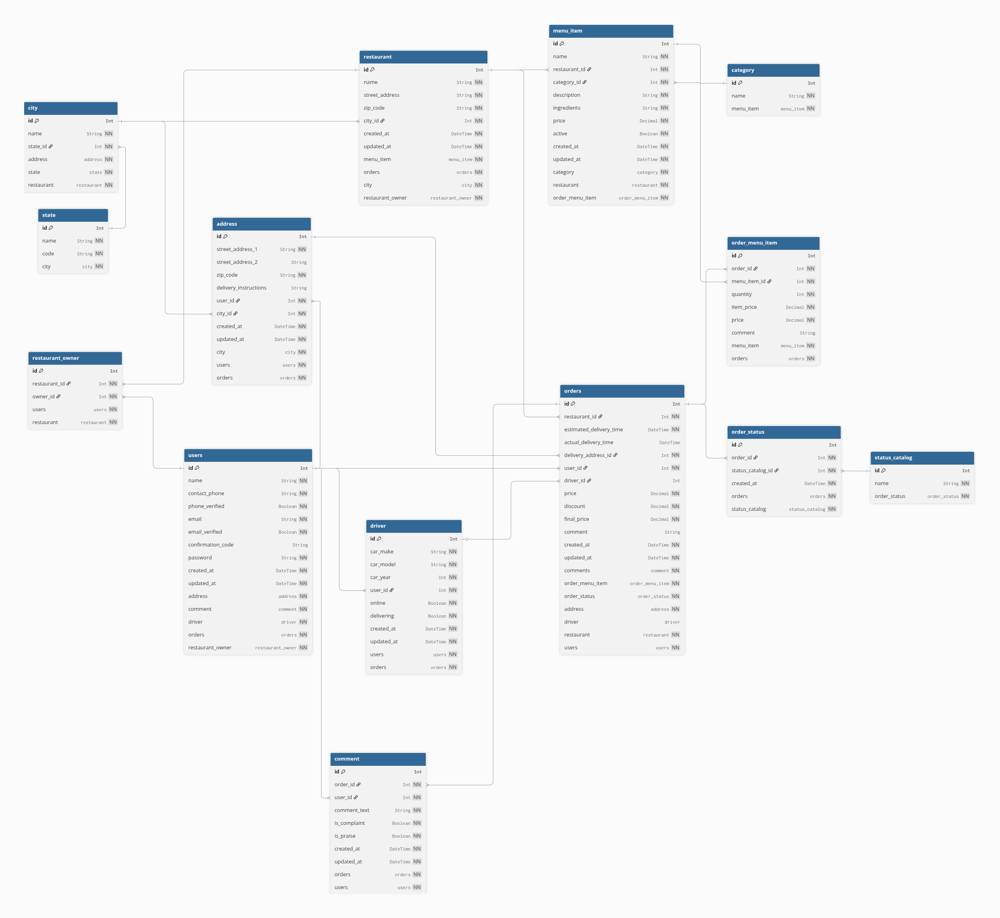

# Drizzle ORM in Practice

Drizzle is an awesome ORM, especially because it fits so well with serverless setups.

To understand it deeply, I built a complete food-delivery database by following [CJ’s tutorial on Syntax](https://www.youtube.com/watch?v=vLze97zZKsU). I wanted every kind of relationship in play—one-to-one, one-to-many, many-to-one, and many-to-many—just to see how Drizzle handles real complexity with simple tools.

As I worked through schemas, foreign keys, composite keys, indexes, and migrations, I started to see the pattern: clarity comes from building each piece intentionally. Seeding the data, running queries, exploring joins, even nesting conditions—it all felt like peeling back layers to reveal how the system thinks.

Once the database felt solid, I wired it up with a lightweight, typesafe API using tRPC and Hono.js. That part reminded me that good interfaces are really just honest conversations between components—clean, direct, and easy to trust.

## Usage

### `docker compose up`

First, copy the `sample.env` file to `.env`, and then run docker compose to set up the PostgreSQL database for this project.

### `volta setup`

This project was developed with Node 24 and NPM 11. 

To set up a compatible environment, please download [Volta](https://github.com/volta-cli/volta) and run `volta setup`.

### `npm run db:migrate`

Run this command to apply migrations from Drizzle to the PostgreSQL database inside the Docker container.

### `npm run db:seed`

Run this command to seed the the dummy data to the PostgreSQL database inside the Docker container.

### `npm run dev:api`

Run this command to start the Hono.js server with an API built using tRPC server.

### `npm run dev:client`

Run this command to consume the API on the client safely using the tRPC client.

# Diagram

