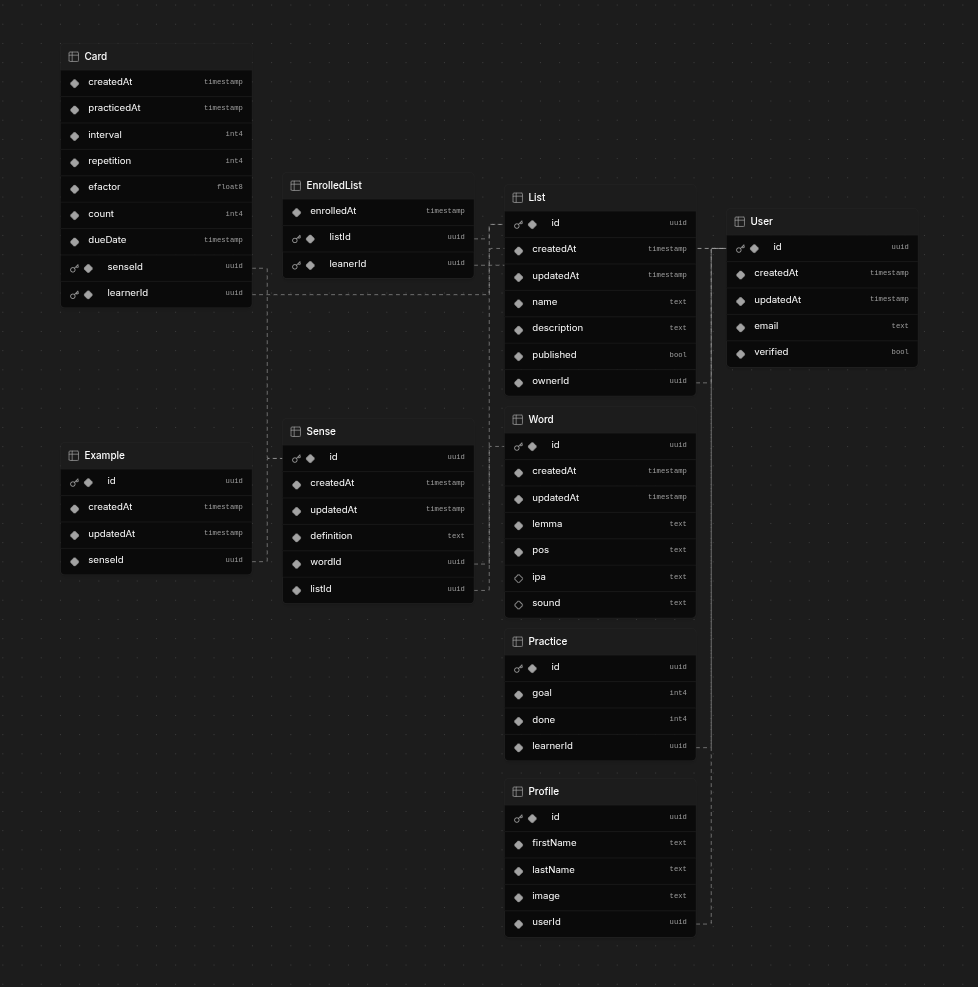

# Prisma ORM in Practice

I once built a database for a product I was working on—something for English learners. Simple, but useful.

I used Prisma. Designed it to store words, their senses, and example sentences. Users could create their own lists, picking the words and senses they wanted to practice. They could even track their progress with [SuperMemo](https://github.com/VienDinhCom/supermemo) flashcards.

This database comprehensively includes various types of relationships, such as One-to-One, One-to-Many, Many-to-One, and Many-to-Many, ensuring efficient data organization and seamless interaction between different entities.

Although it never became a big product, I learned a lot. Now, I’m sharing it—a minimal database version of my product—in hopes that someone else might find it useful or even be inspired to spark a new idea.

That’s the thing about building—it’s never just about the final product. It’s about what you pick up along the way.

## Usage

### `docker compose up`

First, copy the `sample.env` file to `.env`, and then run docker compose to set up the PostgreSQL database for this project.

### `volta setup`

This project was developed with Node 22 and NPM 10. 

To set up a compatible environment, please download [Volta](https://github.com/volta-cli/volta) and run `volta setup`.

### `npm run migrate:dev`

Finally, run this command to apply migrations from Prisma to the PostgreSQL database inside the Docker container.

# Diagram

