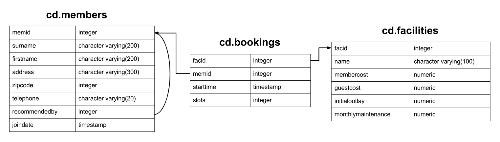

# PostgreSQL Exercises

I started with the basics of [Relational Database](../freecodecamp-relational-database/)—tables, queries, all that. Felt good. But then I realized... there’s more. A lot more.

Joins, subqueries, aggregates—they’re like puzzle pieces, making data more useful. Window functions? Game-changer. Recursive queries? Mind-bending, but powerful.

I worked through exercises, testing, failing, trying again. Each concept clicked, one by one. And suddenly, databases weren’t just about storing data. They were about shaping it, optimizing it, making it work smarter.

It’s a process. But if you push past the basics, you see the real power of PostgreSQL. And that’s where things get interesting.

You can find the exercises here: [PostgreSQL Exercises](https://pgexercises.com/)

## Exercises

- [Category](https://pgexercises.com/questions/basic/) - [Source](./01-basic/) - Simple SQL Queries
- [Category](https://pgexercises.com/questions/joins/) - [Source](./02-joins-and-subqueries/) - Joins and Subqueries
- [Category](https://pgexercises.com/questions/updates/) - [Source](./03-modifying-data/) - Modifying Data
- [Category](https://pgexercises.com/questions/aggregates/) - [Source](./04-aggregation/) - Aggregation
- [Category](https://pgexercises.com/questions/date/) - [Source](./05-date/) - Working with Timestamps
- [Category](https://pgexercises.com/questions/string/) - [Source](./06-string/) - String Operations
- [Category](https://pgexercises.com/questions/recursive/) - [Source](./07-recursive/) - Recursive Queries

## Diagram

