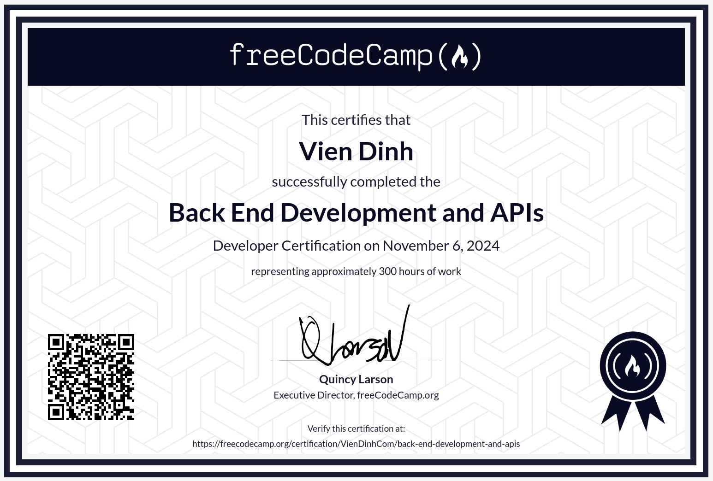

# Back End Development and APIs

You know, I’ve worked with different ways to build APIs—Express.js, Next.js, serverless, even GraphQL with Hasura. But this course took me deeper.

I really got to understand HTTP—methods, headers, status codes, all the little details. I built backend apps with Node.js, used Express for web applications, and created microservices with MongoDB and Mongoose.

I also learned to run MongoDB using Docker and Docker Compose. That was a game changer for development.

It’s one thing to use tools—it’s another to really understand them. And that’s what this course helped me do.

You can find the course here: [Back End Development and APIs](https://www.freecodecamp.org/learn/back-end-development-and-apis/) & [Certificate](https://www.freecodecamp.org/certification/VienDinhCom/back-end-development-and-apis)

## Projects

- [Brief](https://www.freecodecamp.org/learn/back-end-development-and-apis/back-end-development-and-apis-projects/timestamp-microservice) - [Source](projects/timestamp-microservice/) - Timestamp Microservice
- [Brief](https://www.freecodecamp.org/learn/back-end-development-and-apis/back-end-development-and-apis-projects/request-header-parser-microservice) - [Source](projects/request-header-parser-microservice/) - Request Header Parser Microservice
- [Brief](https://www.freecodecamp.org/learn/back-end-development-and-apis/back-end-development-and-apis-projects/url-shortener-microservice) - [Source](projects/url-shortener-microservice/) - URL Shortener Microservice
- [Brief](https://www.freecodecamp.org/learn/back-end-development-and-apis/back-end-development-and-apis-projects/exercise-tracker) - [Source](projects/exercise-tracker/) - Exercise Tracker
- [Brief](https://www.freecodecamp.org/learn/back-end-development-and-apis/back-end-development-and-apis-projects/file-metadata-microservice) - [Source](projects/file-metadata-microservice/) - File Metadata Microservice

## Certificate

