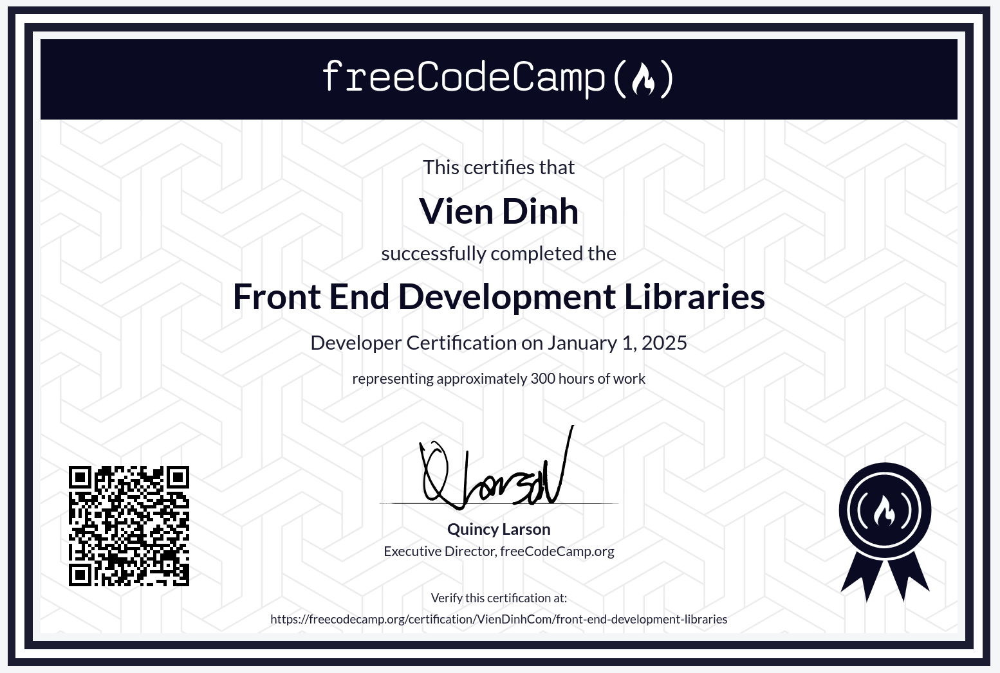

# Front End Development Libraries

I’ve built a lot of websites—used BEM, Tailwind, Bootstrap, Sass, jQuery, React, Redux—you name it. But this course took my skills deeper.

I dived into Bootstrap and jQuery, then added logic to CSS using Sass. Next, I built a shopping cart—really got into React and Redux, crafting powerful single-page apps.

And finally, I pushed further, using TypeScript, React, and Vite to build certification projects.

It wasn’t just about learning tools. It made me think like a developer—structured, creative, efficient. And that changed everything.

You can find the course here: [Front End Development Libraries](https://www.freecodecamp.org/learn/front-end-development-libraries/) & [Certificate](https://www.freecodecamp.org/certification/VienDinhCom/front-end-development-libraries)

## Projects

- [Brief](https://www.freecodecamp.org/learn/front-end-development-libraries/front-end-development-libraries-projects/build-a-random-quote-machine) - [Source](projects/random-quote-machine) - [Demo](https://front-end-development-libraries.vercel.app/projects/random-quote-machine/random-quote-machine.html) - Random Quote Machine
- [Brief](https://www.freecodecamp.org/learn/front-end-development-libraries/front-end-development-libraries-projects/build-a-markdown-previewer) - [Source](projects/markdown-previewer) - [Demo](https://front-end-development-libraries.vercel.app/projects/markdown-previewer/markdown-previewer.html) - Markdown Previewer
- [Brief](https://www.freecodecamp.org/learn/front-end-development-libraries/front-end-development-libraries-projects/build-a-drum-machine) - [Source](projects/drum-machine) - [Demo](https://front-end-development-libraries.vercel.app/projects/drum-machine/drum-machine.html) - Drum Machine
- [Brief](https://www.freecodecamp.org/learn/front-end-development-libraries/front-end-development-libraries-projects/build-a-javascript-calculator) - [Source](projects/javascript-calculator) - [Demo](https://front-end-development-libraries.vercel.app/projects/javascript-calculator/javascript-calculator.html) - JavaScript Calculator
- [Brief](https://www.freecodecamp.org/learn/front-end-development-libraries/front-end-development-libraries-projects/build-a-25--5-clock) - [Source](projects/25--5-clock) - [Demo](https://front-end-development-libraries.vercel.app/projects/25--5-clock/25--5-clock.html) - 25 + 5 Clock

## Certificate

