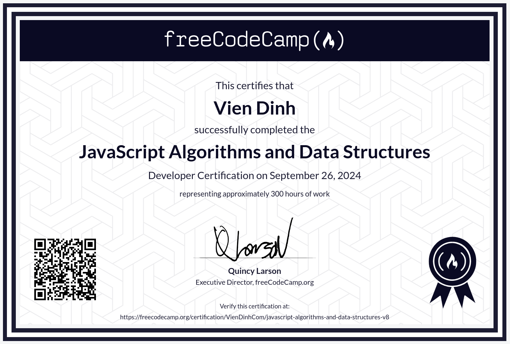

# JavaScript Algorithms and Data Structures

You can find the course here: [JavaScript Algorithms and Data Structures](https://www.freecodecamp.org/learn/javascript-algorithms-and-data-structures-v8/) & [Certificate](https://www.freecodecamp.org/certification/VienDinhCom/javascript-algorithms-and-data-structures-v8)

## Projects

- [Source](/projects/palindrome-checker.ts) - Palindrome Checker
- [Source](/projects/roman-numeral-converter.ts) - Roman Numeral Converter
- [Source](/projects/telephone-number-validator.ts) - Telephone Number Validator
- [Source](/projects/cash-register.ts) - Cash Register
- [Source](/projects/pokemon-search.ts) - Pokémon Search

## Certificate

