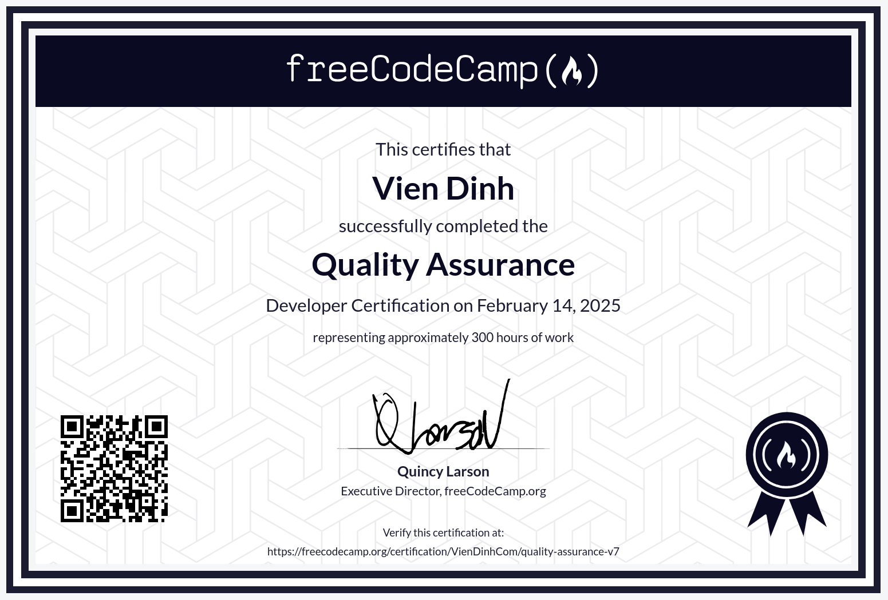

# Quality Assurance

I’ve worked with Jest, React Testing Library, and Deno Test before, but with this course, I took things deeper.

I learned to write tests using Chai and run them with Mocha, making sure my applications behave as expected.

I also set up MongoDB with Docker, built a chat app, and explored advanced Node and Express concepts. Along the way, I used Pug for templating, Passport for authentication, and Socket.io for real-time communication.

Unit testing, functional testing—every piece fits together. More than just tools, it was about building confidence in my code.

You can find the course here: [Quality Assurance](https://www.freecodecamp.org/learn/quality-assurance/) & [Certificate](https://www.freecodecamp.org/certification/VienDinhCom/quality-assurance-v7)

## Projects

- [Brief](https://www.freecodecamp.org/learn/quality-assurance/quality-assurance-projects/metric-imperial-converter) - [Source](projects/metric-imperial-converter/) - Metric-Imperial Converter
- [Brief](https://www.freecodecamp.org/learn/quality-assurance/quality-assurance-projects/issue-tracker) - [Source](projects/issue-tracker/) - Issue Tracker
- [Brief](https://www.freecodecamp.org/learn/quality-assurance/quality-assurance-projects/personal-library) - [Source](projects/personal-library/) - Personal Library
- [Brief](https://www.freecodecamp.org/learn/quality-assurance/quality-assurance-projects/sudoku-solver) - [Source](projects/sudoku-solver/) - Sudoku Solver
- [Brief](https://www.freecodecamp.org/learn/quality-assurance/quality-assurance-projects/american-british-translator) - [Source](projects/american-british-translator/) - American British Translator

## Certificate

