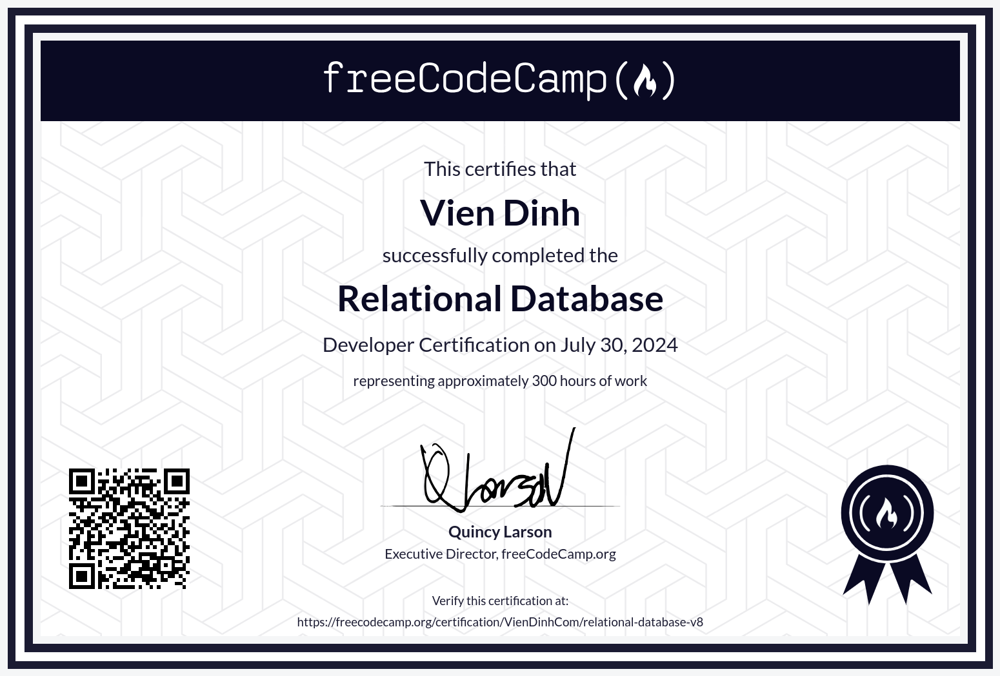

# Relational Database

You know, I used to avoid writing raw SQL. I relied on ORMs like Prisma or TypeORM to handle everything for me. It worked—until I realized I didn’t really understand databases.

So, I took a deep dive. Learned how to create and manage relational databases with PostgreSQL. Got my hands dirty with SQL—actually writing queries, optimizing them. Along the way, I picked up more Bash and Git too.

I also sharpen my skills even further with exercises at [pgexercises.com](../database-postgresql-exercises/). Because knowing SQL? It’s not just useful—it’s essential. And I’m finally starting to appreciate why.

You can find the course here: [Relational Database](https://www.freecodecamp.org/learn/relational-database/) & [Certificate](https://www.freecodecamp.org/certification/VienDinhCom/relational-database-v8)

## Projects

- [Source](projects/celestial-bodies/) - Celestial Bodies
- [Source](projects/world-cup/) - World Cup
- [Source](projects/salon-appointment-scheduler/) - Salon Appointment Scheduler
- [Source](projects/periodic-table/) - Periodic Table
- [Source](projects/number-guessing-game/) - Number Guessing Game

## Certificate

