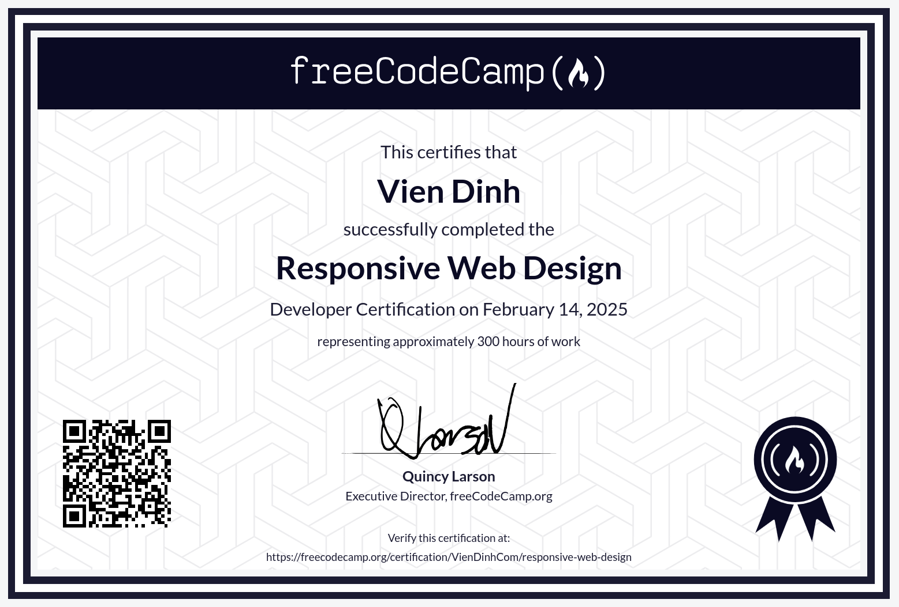

# Responsive Web Design

You know, I thought I had responsive web design figured out. I’ve built plenty of templates with HTML, CSS, and BEM. But this course? It humbled me.

It took me back to basics—structuring content with HTML, styling with CSS. I started simple, building a cat photo app. Then, I explored CSS variables with a penguin and improved accessibility with a quiz site.

By the end, I was designing layouts that adapt beautifully—Flexbox for a photo gallery, CSS Grid for a magazine page.

Turns out, even experienced developers have more to learn. And that’s the fun part.

You can find the course here: [Responsive Web Design](https://www.freecodecamp.org/learn/2022/responsive-web-design/) & [Certificate](https://www.freecodecamp.org/certification/VienDinhCom/responsive-web-design)

## Projects

- [Brief](https://www.freecodecamp.org/learn/2022/responsive-web-design/build-a-survey-form-project/build-a-survey-form) - [Source](projects/survey-form) - [Demo](https://responsive-web-design-vien.vercel.app/projects/survey-form/survey-form.html) - Survey Form
- [Brief](https://www.freecodecamp.org/learn/2022/responsive-web-design/build-a-tribute-page-project/build-a-tribute-page) - [Source](projects/tribute-page) - [Demo](https://responsive-web-design-vien.vercel.app/projects/tribute-page/tribute-page.html) - Tribute Page
- [Brief](https://www.freecodecamp.org/learn/2022/responsive-web-design/build-a-technical-documentation-page-project/build-a-technical-documentation-page) - [Source](projects/technical-documentation-page) - [Demo](https://responsive-web-design-vien.vercel.app/projects/technical-documentation-page/technical-documentation-page.html) - Technical Documentation Page
- [Brief](https://www.freecodecamp.org/learn/2022/responsive-web-design/build-a-product-landing-page-project/build-a-product-landing-page) - [Source](projects/product-landing-page) - [Demo](https://responsive-web-design-vien.vercel.app/projects/product-landing-page/product-landing-page.html) - Product Landing Page
- [Brief](https://www.freecodecamp.org/learn/2022/responsive-web-design/build-a-personal-portfolio-webpage-project/build-a-personal-portfolio-webpage) - [Source](projects/personal-portfolio-webpage) - [Demo](https://responsive-web-design-vien.vercel.app/projects/personal-portfolio-webpage/personal-portfolio-webpage.html) - Personal Portfolio Webpage

## Certificate

